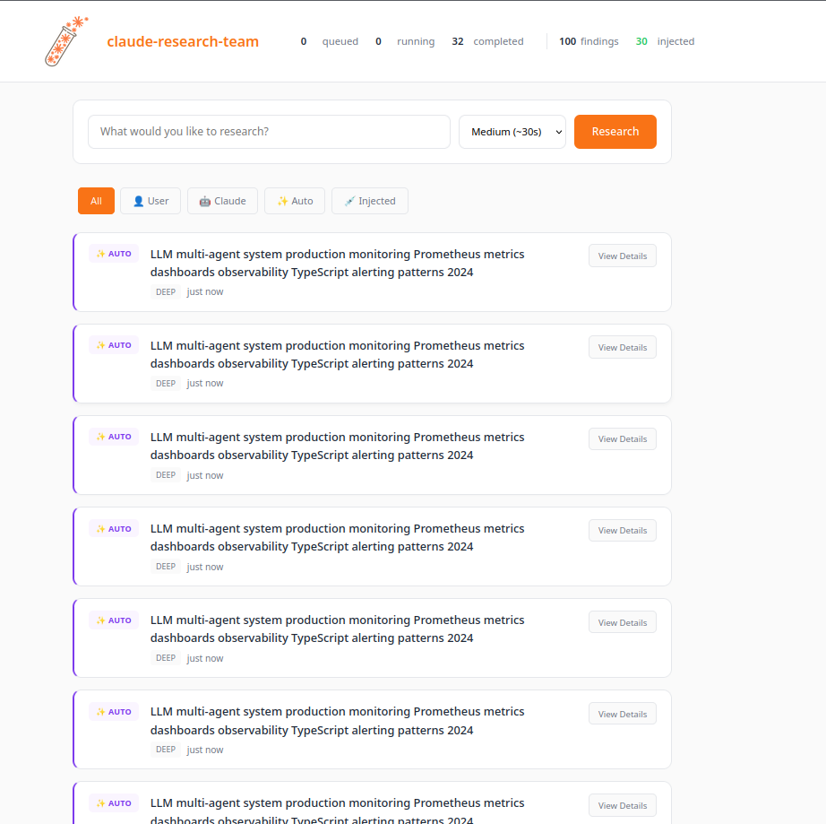

<p align="center">
  
</p>

<h1 align="center">Claude Research Team</h1>

<p align="center">
  <strong>Autonomous multi-agent research for Claude Code</strong>
</p>

<p align="center">
  <a href="https://www.gnu.org/licenses/agpl-3.0"></a>
  <a href="https://bun.sh"></a>
  <a href="https://claude.com/claude-code"></a>
</p>

---

A background research service that watches your Claude Code sessions, detects when external information would help, and injects synthesized findings directly into your conversation context.

## Features

- **Autonomous detection** — Analyzes prompts and tool outputs for research opportunities
- **17+ search sources** — GitHub, StackOverflow, npm, PyPI, crates.io, Reddit, HackerNews, Wikipedia, ArXiv, and more
- **Multi-agent architecture** — Three specialist agents (WebSearch, CodeExpert, DocsExpert) work in parallel
- **AI synthesis** — Claude SDK or Gemini Flash distills findings into actionable context
- **Real-time dashboard** — Monitor research activity, queue status, and configure settings
- **Progressive disclosure** — Concise summaries with expandable detail on demand
- **Project-aware** — Understands your tech stack from package.json to prioritize relevant results
- **Rate-limited** — Built-in protections against excessive API usage

---

## Dashboard

<p align="center">
  
</p>

<p align="center">
  <em>Research findings with sources and expandable details</em>
</p>

---

## Quick Start

```bash
# Clone and install
git clone https://github.com/bigph00t/claude-research-team
cd claude-research-team
bun install
bun run build

# Configure at least one search API
export SERPER_API_KEY="your-key"

# Install as Claude Code plugin
claude plugins install .

# Start the service
bun run start
```

Dashboard: [http://localhost:3200](http://localhost:3200)

---

## Architecture

```
┌─────────────────────────────────────────────────────────────────┐
│                     Claude Code Session                          │
│                                                                  │
│   Hooks: SessionStart | UserPromptSubmit | PostToolUse          │
└──────────────────────────────┬──────────────────────────────────┘
                               │
                               ▼
┌─────────────────────────────────────────────────────────────────┐
│                  Research Service (port 3200)                    │
│                                                                  │
│  ┌────────────────┐   ┌────────────────┐   ┌────────────────┐   │
│  │ Conversation   │──▶│  Coordinator   │──▶│    Queue       │   │
│  │ Watcher        │   │  (AI Planner)  │   │    Manager     │   │
│  └────────────────┘   └────────────────┘   └────────────────┘   │
│                                                   │              │
│                    ┌──────────────────────────────┼──────────┐  │
│                    │                              │          │  │
│                    ▼                              ▼          ▼  │
│  ┌──────────────────────┐ ┌──────────────────────┐ ┌─────────────┐
│  │    WebSearch Agent   │ │    CodeExpert Agent  │ │ DocsExpert  │
│  │                      │ │                      │ │   Agent     │
│  │  Serper              │ │  GitHub              │ │ Wikipedia   │
│  │  Brave               │ │  StackOverflow       │ │ ArXiv       │
│  │  Tavily              │ │  npm                 │ │ HackerNews  │
│  │  DuckDuckGo          │ │  PyPI                │ │ Reddit      │
│  │                      │ │  crates.io           │ │ MDN         │
│  │                      │ │                      │ │ Dev.to      │
│  └──────────────────────┘ └──────────────────────┘ └─────────────┘
│                    │              │                      │       │
│                    └──────────────┴──────────────────────┘       │
│                                   │                              │
│                                   ▼                              │
│                    ┌──────────────────────────┐                  │
│                    │  Jina Reader (scraping)  │                  │
│                    └──────────────────────────┘                  │
│                                   │                              │
│                                   ▼                              │
│                    ┌──────────────────────────┐                  │
│                    │   AI Synthesis           │                  │
│                    │   (Claude SDK / Gemini)  │                  │
│                    └──────────────────────────┘                  │
│                                   │                              │
│                                   ▼                              │
│                    ┌──────────────────────────┐                  │
│                    │   SQLite + FTS5          │                  │
│                    │   (findings database)    │                  │
│                    └──────────────────────────┘                  │
└─────────────────────────────────────────────────────────────────┘
```

---

## Configuration

### API Keys

Set up in `.env` or export directly:

```bash
# Search APIs (at least one required)
SERPER_API_KEY=xxx       # serper.dev - Google Search (2,500/mo free)
BRAVE_API_KEY=xxx        # brave.com/search/api (2,000/mo free)
TAVILY_API_KEY=xxx       # tavily.com (1,000/mo free)

# Code search
GITHUB_TOKEN=xxx         # GitHub API for code/repo search

# AI synthesis (choose one)
# Default: Uses Claude SDK (your Anthropic account)
GEMINI_API_KEY=xxx       # Alternative: Gemini Flash (free tier)
```

### Free Tools (No API Key)

These work out of the box:
- **Search**: DuckDuckGo
- **Code**: StackOverflow, npm, PyPI, crates.io
- **Documentation**: Wikipedia, ArXiv, HackerNews, Reddit, MDN, Dev.to
- **Scraping**: Jina Reader

### Dashboard Settings

Access at [http://localhost:3200](http://localhost:3200):

| Setting | Default | Description |
|---------|---------|-------------|
| AI Provider | Claude | Claude SDK or Gemini Flash |
| Model | Haiku | Claude model tier (Haiku/Sonnet/Opus) |
| Autonomous Research | Enabled | Auto-trigger research from conversation |
| Confidence Threshold | 0.85 | Minimum confidence to trigger (0.5-0.95) |
| Session Cooldown | 60s | Minimum time between researches |
| Max Per Hour | 20 | Global hourly research limit |

---

## Usage

### Automatic Mode

Once installed and running, research happens automatically:

1. You chat with Claude Code normally
2. The Conversation Watcher detects questions, errors, or unfamiliar topics
3. Specialist agents research in parallel
4. AI synthesizes findings
5. Context injects into your next prompt

```
<research-context query="TypeScript fetch API error handling">
Use try/catch with async/await for network errors. Check response.ok
for HTTP status errors (4xx/5xx). Type errors as unknown in catch blocks.

**Sources:**
- web.dev/articles/fetch-api-error-handling
- dev.to/jesterxl/error-handling-for-fetch-in-typescript

_More detail: /research-detail abc123_
</research-context>
```

### Manual Research

Use skills in Claude Code:

```
/research How to implement rate limiting in Express.js

/research-status

/research-detail <finding-id>
```

Or search directly from the dashboard.

### Research Depths

| Depth | Time | Best For |
|-------|------|----------|
| quick | ~5s | Facts, definitions, simple questions |
| medium | ~15s | How-to guides, documentation lookup |
| deep | ~30s | Comparisons, comprehensive analysis |

---

## Project Structure

```
claude-research-team/
├── src/
│   ├── agents/
│   │   ├── coordinator.ts          # AI research planner
│   │   ├── conversation-watcher.ts # Detects research triggers
│   │   └── specialists/
│   │       ├── base.ts             # Specialist base class
│   │       ├── web-search.ts       # Serper, Brave, Tavily, DuckDuckGo
│   │       ├── code-expert.ts      # GitHub, SO, npm, PyPI, crates.io
│   │       └── docs-expert.ts      # Wikipedia, ArXiv, HN, Reddit, MDN
│   ├── ai/
│   │   └── provider.ts             # Claude SDK / Gemini abstraction
│   ├── context/
│   │   └── project-context.ts      # package.json analysis
│   ├── crew/
│   │   ├── autonomous-crew.ts      # Multi-agent orchestration
│   │   └── research-executor.ts    # Task execution
│   ├── database/
│   │   ├── index.ts                # SQLite + FTS5 storage
│   │   └── sqlite-adapter.ts       # Bun SQLite compatibility
│   ├── hooks/
│   │   ├── session-start.ts        # Register session
│   │   ├── user-prompt-submit.ts   # Analyze prompts
│   │   ├── post-tool-use.ts        # Check tool outputs
│   │   └── session-end.ts          # Cleanup
│   ├── injection/
│   │   └── manager.ts              # Context injection logic
│   ├── queue/
│   │   └── manager.ts              # Research task queue
│   ├── service/
│   │   ├── server.ts               # HTTP + WebSocket + Dashboard
│   │   └── session-manager.ts      # Session tracking
│   ├── skills/
│   │   ├── research.ts             # /research skill
│   │   ├── research-status.ts      # /research-status skill
│   │   └── research-detail.ts      # /research-detail skill
│   └── types.ts                    # TypeScript definitions
├── assets/
│   ├── logo.png                    # Static logo
│   ├── logo-animated.webp          # Animated logo (research active)
│   ├── dashboard-findings.png      # Dashboard UI screenshot
│   └── dashboard-settings.png      # Settings panel screenshot
├── plugin.json                     # Claude Code plugin manifest
└── package.json
```

---

## API Reference

### Status

```http
GET /api/status          # Service status and config
GET /api/queue/stats     # Queue statistics
```

### Research

```http
POST /api/research
Content-Type: application/json

{
  "query": "how to implement caching in Node.js",
  "depth": "medium",
  "trigger": "user"
}
```

### Findings

```http
GET /api/findings                     # All findings
GET /api/findings?project=/path/to    # Filter by project
GET /api/findings?limit=10            # Limit results
```

### Settings

```http
GET /api/settings                     # Current configuration
POST /api/settings                    # Update settings
POST /api/settings/reset              # Reset to defaults
```

### Sessions

```http
GET /api/sessions                     # Active sessions
POST /api/sessions                    # Create session
GET /api/sessions/:id/debug           # Session debug info
```

---

## Development

```bash
# Install dependencies
bun install

# Build
bun run build

# Watch mode
bun run dev

# Start service
bun run start

# Clean build
bun run clean && bun run build

# Run tests
bun test
```

---

## Troubleshooting

**Service won't start**
```bash
lsof -i :3200  # Check if port is in use
bun run start  # Start manually
```

**No research triggering**
- Check dashboard: Is autonomous research enabled?
- Lower confidence threshold (try 0.7)
- Verify API keys are set

**Plugin not working**
```bash
claude plugins list           # Verify installation
bun run clean && bun run build  # Rebuild
claude plugins install .      # Reinstall
```

---

## License

AGPL-3.0 — See [LICENSE](LICENSE)

---

<p align="center">
  <sub>Built for developers who want Claude to know what they're Googling anyway.</sub>
</p>
